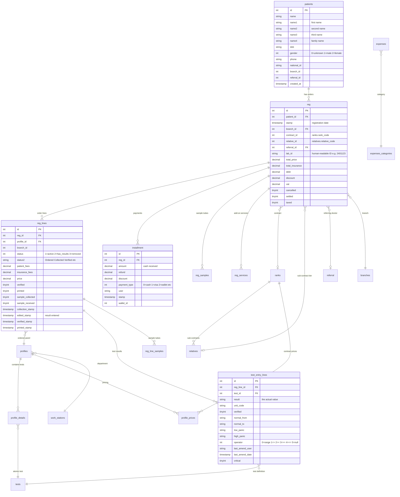

# 🧬 Laboratory Information System (LIS) Database Schema

## 📋 Overview

This document describes the full schema of the **Yaseer LIS** database (`lis_tarqeem`/`lis_rowad`). The system is a comprehensive **Laboratory Information System** managing the entire lab workflow: Patient Registration → Order Entry → Sample Collection → Result Entry → Verification → Reporting → Billing.

The database contains **~130 tables** (including views and backup tables). The source of truth is `lis_blueprint.sql` (4556 lines).

### Key Conventions
- **`labId`** column appears on nearly every table — supports multi-tenant (multi-lab) configurations.
- **Sentinel dates** like `'1971-12-31 22:00:00'` or `'1972-01-01 00:00:00'` mean "not yet set" (used instead of NULL for timestamps).
- **Soft deletes** — rows are rarely deleted. Status fields (e.g., `reg_lines.status = 3`) mark removal instead.
- **Triggers** are heavily used for audit logging, auto-calculations, and cascading logic.

---

## 🔄 Core Workflow

```
Patient Registration → Order Entry → Sample Collection → Result Entry → Verification → Print/Deliver
     (patients)         (reg, reg_lines)  (reg_samples)   (test_entry_lines)  (reg_lines.verified)  (reg_lines.printed)
```

---

## 🗺️ Entity Relationship Diagram



---

## 📔 Complete Table Reference

### 🩺 1. Patient Domain

| Table | Description | Key Columns | Relationships |
|-------|-------------|-------------|---------------|
| `patients` | Patient demographics. One row per patient across all visits. | `id`, `name`, `name1`-`name4` (name parts), `en_name`, `escaped_arabic_name`, `dob` (varchar), `gender` (0=unknown, 1=male, 2=female), `title`, `phone`, `phone2`, `national_id`, `passport_id`, `nationality`, `email`, `residence`, `branch_id`, `branch_key`, `referral_id`, `is_clinic`, `created_at`, `updated_at` | PK `id` → referenced by `reg.patient_id` |
| `patients2` | Clinic patients (separate module with `is_clinic=1`). Same structure as `patients`. | Same as `patients` | Used by clinic module |
| `patients_update_log` | Audit log of patient edits (name, DOB, gender, phone changes). Auto-populated by triggers on `patients`. | `patient_id`, `username`, `name`, `dob`, `gender`, `phone`, `stamp`, `authorized` | `patient_id` → `patients.id` |
| `patient_titles` | Title lookup (Mr, Mrs, Child, etc.) with gender/age_group mapping. | `id`, `title`, `gender`, `age_group` | Referenced by `patients.title` (string match) |
| `patient_appointments` | Appointment scheduling for clinic patients. | `id`, `patient_id`, `start`, `end`, `status`, `resource` | `patient_id` → `patients.id` |
| `patient_visits` | Clinical visit notes (SOAP notes). Stores JSON visit data. | `id`, `patient_id`, `type`, `diagnosis`, `visit_data` (JSON) | `patient_id` → `patients.id` |
| `patient_problems` | Ongoing patient problems/conditions list. | `id`, `patient_id`, `problem`, `code`, `ongoing`, `started_at`, `resolved_at` | `patient_id` → `patients.id` |

---

### 🧾 2. Registration & Orders

| Table | Description | Key Columns | Relationships |
|-------|-------------|-------------|---------------|
| `reg` | **Main order/visit table.** One row per patient visit. Contains financial totals, contract info, medical flags. | `id`, `uid` (UUID), `patient_id`, `stamp` (registration date), `created_at`, `branch_id`, `branch_prefix`, `branch_key`, `lab_id` (human-readable e.g. "2401123"), `user` (receptionist), `referral_id`, `referral` (name string), `referral_title`, `contract_id` (→ `ranks.rank_code`), `relative_id` (→ `relatives.relative_code`), `contractor` (name string), `relation` (name string), `total_price`, `total_insurance`, `debt`, `discount`, `vat`, `added_fees`, `package_id`, `cancelled`, `retained`, `settled`, `submitted`, `taxed`, `verified_at`, `pdf_generated_at`, `pdf_url`, `qrcode`, `online_key`, `serial`, `sampler`, `labtolab`, `labtolab_agent_id` | `patient_id` → `patients.id`, `referral_id` → `referral.id`, `contract_id` → `ranks.rank_code`, `relative_id` → `relatives.relative_code`, `branch_id` → `branches.id` |
| `reg_lines` | **Order lines — one per test panel ordered.** Full lifecycle tracking. | `id`, `reg_id`, `profile_id`, `group_id`, `branch_id`, `session_id`, `status` (1=active, 2=has results, 3=removed), `status2` ("Ordered", "Collected", "Verified" etc.), `patient_fees`, `insurance_fees`, `price`, `default_price`, `included` (0=charge, 1=free), `sample_status`, `collection_stamp`, `edited` (0/1), `edited_stamp`, `complete`, `verified` (0/1), `verified_stamp`, `verified_by`, `printed` (0/1), `printed_stamp`, `printed_by`, `received`/`received_stamp`/`received_by`, `delivered`/`deliverd_date`/`delivered_by`, `sample_collected`, `sample_received`, `sample_received_stamp`, `retained`, `expected_time`, `critical`, `reviewed`/`reviewed_stamp`/`reviewed_by`, `revised`/`revised_stamp`/`revised_by`, `whatsapp` (sent), `in_offer`, `in_package`, `comment`, `json_value`, `meta_data`, `partial` | `reg_id` → `reg.id`, `profile_id` → `profiles.profile_id` |
| `reg_cancelled` | Records cancellation events with timestamp and tax status. | `id`, `reg_id`, `created_at`, `taxed` | `reg_id` → `reg.id` |
| `reg_attachments` | Document/image attachments to an order. | `id`, `reg_id`, `title`, `image_uri` | `reg_id` → `reg.id` |
| `reg_notes` | Free-text notes on an order. | `id`, `reg_id`, `user`, `stamp`, `note` | `reg_id` → `reg.id` |
| `reg_services` | Additional services (delivery, home visit) added to an order. | `id`, `reg_id`, `service_id`, `service_name`, `price`, `patient_fees`, `insurance_fees`, `profile_id`, `agent_id` | `reg_id` → `reg.id` |
| `reg_diagrams` | Diagram data attached to results. | `id`, `reg_id`, `group_id`, `group_name` | `reg_id` → `reg.id` |

**`reg_lines.status` values:**
| Value | Meaning |
|-------|---------|
| `0` | Reserved/On Hold |
| `1` | Active/Ordered |
| `2` | Has results entered |
| `3` | Removed/Cancelled (trigger deletes `test_entry_lines` and logs to `removed_reg_lines`) |

**`reg` medical flags** (all int, 0/1): `anemia`, `thyroid`, `diabetes`, `fasting`, `anticoagulant`, `antibiotic`, `antiviral`, `hepatic`, `radiology`, `arthritis`, `hypertension`, `renal_failure`, `lupus_erythematosus`, `biohazard`

---

### 🔬 3. Test Catalog & Results

| Table | Description | Key Columns | Relationships |
|-------|-------------|-------------|---------------|
| `tests` | **Atomic test definitions** (e.g., Hemoglobin, Glucose, TSH). | `test_id` (PK), `test_name`, `report_name`, `unit_code`, `test_type` (1=numeric, 2=text, etc.), `sample_code`, `duration`, `working_days`, `formula`, `low_panic`, `high_panic`, `multiline`, `default_value`, `seq`, `cost`, `auto_verify_percent`, `deltacheck_alarm_percent`, `ai_included` | Referenced by `profile_details.test_id`, `test_entry_lines.test_id` |
| `profiles` | **Orderable panels** (e.g., CBC, Lipid Profile, LFT). What receptionists see. | `profile_id` (PK), `profile_name`, `arabic_name`, `report_name`, `number` (code), `group_id` (→ `work_stations`), `main_group_id`, `station_id`, `seq`, `rep_type`, `visible`, `panel`, `is_mega`, `workdays`, `cost`, `collection` (specimen type), `deleted_at` (soft delete) | `group_id` → `work_stations.group_id` |
| `profile_details` | **Bridge table:** which atomic `tests` belong to which `profiles`. | `id`, `profile_id`, `test_id`, `group_id`, `is_profile` (0=test row, 1=sub-profile header), `test_code`, `test_ser` (display order), `enabled`, `printed`, `displayed`, `decimal_places`, `bold_in_report` | `profile_id` → `profiles.profile_id`, `test_id` → `tests.test_id` |
| `test_entry_lines` | **Actual test result values.** The most critical data table. One row per atomic test per order line. | `id`, `reg_line_id`, `test_id`, `result` (varchar — the actual value), `unit_code`, `verified` (0/1), `is_profile` (0=test, 1=profile header row), `enabled`, `displayed`, `report_name`, `normal_from`, `normal_to`, `operator` (reference range comparison type), `low_panic`, `high_panic`, `low_reportable`, `high_reportable`, `last_amend_user`, `last_amend_date`, `barcode`, `branch_id`, `critical`, `flag`, `created_at` | `reg_line_id` → `reg_lines.id`, `test_id` → `tests.test_id` |
| `test_entry_edit_history` | Audit trail of every result edit (old value → new value, by whom). Auto-populated by triggers. | `id`, `reg_line_id`, `test_entry_id`, `test_id`, `value1` (old), `value2` (new), `user`, `stamp` | `test_entry_id` → `test_entry_lines.id` |
| `reg_lines_details` | Display structure for result entry (which tests to show in what order). | `id`, `reg_line_id`, `test_id`, `is_profile`, `indentation`, `report_name`, `serial`, `enabled` | `reg_line_id` → `reg_lines.id` |
| `normal_range` | Age/gender/device-specific reference ranges for tests. | `id`, `test_id`, `dev_id`, `gender`, `age_from`, `age_to`, `normal_from`, `normal_to`, `operator`, `unit`, `branch_id` | `test_id` → `tests.test_id` |
| `reportable_range` | Reportable range limits (analytical measurement range). | `id`, `test_id`, `dev_id`, `reportable_from`, `reportable_to` | `test_id` → `tests.test_id` |
| `test_value_list` | Predefined dropdown options for text-type tests (e.g., Positive/Negative). | `id`, `test_id`, `abbrev`, `list_item`, `flag` | `test_id` → `tests.test_id` |
| `mega_profiles` | Super-groups that bundle multiple profiles together. | `group_code`, `mega_code`, `mega_name` | |
| `mega_profile_details` | Which profiles belong to a mega profile. | `group_code`, `mega_code`, `profile_code` | |

**`test_entry_lines.operator` values (reference range comparison):**
| Value | Symbol | Meaning |
|-------|--------|---------|
| `0` | `-` | Range (from - to) |
| `1` | `>` | Greater than |
| `2` | `<` | Less than |
| `3` | `>=` | Greater or equal |
| `4` | `<=` | Less or equal |
| `5` | ∅ | Null / Not applicable |

**`test_entry_lines.is_profile` filtering:**
- `is_profile = 0` → actual test result rows (what you want for analytics)
- `is_profile = 1` → profile/section header rows (display only, skip in analytics)

---

### 🧪 4. Sample Tracking

| Table | Description | Key Columns | Relationships |
|-------|-------------|-------------|---------------|
| `samples` | Sample tube catalog (definitions). | `id`, `sample_code`, `sample_name`, `sample_code_name`, `tube_size`, `sample_group`, `label_style`, `precautions` | Referenced by `tests.sample_code`, `profile_samples.sample_id` |
| `profile_samples` | Which sample tubes each profile requires. | `id`, `profile_id`, `sample_id`, `sample_code`, `suffix` | `profile_id` → `profiles.profile_id`, `sample_id` → `samples.id` |
| `reg_samples` | **Actual sample tubes** created for an order. Full tracking. | `id`, `reg_id`, `sample_id`, `barcode`, `sample_barcode`, `sample_name`, `profile_name`, `status`, `status2` ("ordered", "collected", etc.), `serial`, `branch_id`, `target_branch_id`, `target_station_id`, `current_branch_id`, `current_station_id`, `uid`, `deleted`, `username` | `reg_id` → `reg.id` |
| `reg_line_samples` | Sample tubes linked to specific order lines. | `id`, `reg_line_id`, `sample_code`, `sample_name`, `suffix`, `status`, `position`, `last_amend_user` | `reg_line_id` → `reg_lines.id` |
| `reg_sample_log` | Audit trail of sample status changes (movements, rejections). | `id`, `reg_sample_id`, `stamp`, `action`, `status`, `branch_id`, `station_id`, `rack_id`, `rack_position`, `notes`, `username` | `reg_sample_id` → `reg_samples.id` |
| `reg_sample_panels` | Links sample tubes to profiles/order lines. | `id`, `reg_sample_id`, `profile_id`, `reg_line_id` | Bridge table |
| `reg_line_samples_history` | History of sample status/position changes per order line. | `id`, `reg_line_sample_id`, `status`, `position`, `user` | |
| `sample_stages` | Configurable sample workflow stages. | `id`, `title`, `order`, `description` | |
| `sample_stations` | Physical sample processing stations per branch. | `id`, `branch_id`, `station_name`, `central` | |
| `racks` | Sample storage racks with row/column layout. | `id`, `rack_name`, `branch_id`, `station_id`, `row_count`, `col_count` | |

---

### 💰 5. Financial & Pricing

| Table | Description | Key Columns | Relationships |
|-------|-------------|-------------|---------------|
| `installment` | **Payment transactions.** Each row is a cash receipt, refund, or discount event against an order. | `id`, `reg_id`, `amount` (cash received), `refund`, `discount`, `payment_type`, `wallet_id`, `user`, `stamp`, `branch_id`, `lab_id`, `receipt_number` | `reg_id` → `reg.id` |
| `profile_prices` | **Main pricing table.** Per-contract per-profile pricing with patient/insurance split. | `id`, `contract_id` (0 or 1 = standard, >1 = contract), `relative_id`, `profile_id`, `price` (total), `patient_payment`, `insurance_payment`, `branch_id` | `profile_id` → `profiles.profile_id`, `contract_id` → `ranks.rank_code` |
| `expenses` | Operational expenses (petty cash outflows). | `id`, `amount`, `description`, `category_id`, `user`, `stamp`, `branch_id`, `lab_id` | `category_id` → `expenses_categories.id` |
| `expenses_categories` | Expense category lookup. | `id`, `name` | Referenced by `expenses.category_id` |
| `closures` | **Cash drawer closures.** End-of-shift cash handover events. | `id`, `stamp`, `user`, `sum`, `to_account`, `to_account_type` | Standalone |
| `invoices` | Formal invoice headers (for insurance/corporate billing). | `id`, `company_id`, `description`, `username`, `from_date`, `to_date`, `invoice_type`, `branch_id` | |
| `invoice_lines` | Line items on an invoice. | `id`, `invoice_id`, `item_id`, `item_description`, `unit_price`, `amount`, `expiry_date` | `invoice_id` → `invoices.id` |
| `invoice_installments` | Payments made against invoices. | `id`, `invoice_id`, `installment`, `user`, `payment_type`, `receipt_date` | `invoice_id` → `invoices.id` |
| `money_back` | Refund/price adjustment records (old price → new price). | `id`, `reg_id`, `reg_line_id`, `old_patient`, `new_patient`, `old_insurance`, `new_insurance`, `user` | `reg_id` → `reg.id` |
| `added_fees` | Additional fees added to orders. | `id`, `reg_id`, `fees`, `user`, `stamp` | `reg_id` → `reg.id` |
| `wallets` | Payment wallet definitions (Cash, Visa, Insurance wallet, etc.). | `id`, `name`, `uid`, `data` | Referenced by `installment.wallet_id` |
| `safes` | Cash safe definitions. | `id`, `safe_name`, `basic`, `active` | |
| `safe_users` | Which users are assigned to which safes. | `id`, `user_id`, `safe_id` | |
| `tax_report_lines` | Tax report line items by date/branch. | `id`, `date`, `year`, `month`, `reg_id`, `branch_id` | |
| `uploaded_contract_invoices` | E-invoices submitted to tax portal. | `id`, `uid`, `contract_id`, `portal_status`, `portal_data`, `invoice` (JSON) | |

**`installment.payment_type` values:**
| Value | Meaning |
|-------|---------|
| `0` | 💵 Cash payment (negative amount = refund) |
| `1` | 📉 Discount (negative = cancelled discount) |
| `2` | 💳 Payment to wallet / card |

---

### 🏢 6. Contracts & Companies

| Table | Description | Key Columns | Relationships |
|-------|-------------|-------------|---------------|
| `ranks` | **Companies/Contracts.** Each rank is a company or insurance agreement. | `id`, `rank_code` (unique, auto-generated — this is the FK used in `reg.contract_id`), `rank_name`, `percent`, `contact`, `type` (0=company, 1=individual), `credit_limit`, `user`, `conditions`, `tax_id`, `visible` | `rank_code` referenced by `reg.contract_id` and `relatives.rank_code` |
| `relatives` | **Sub-contracts/tiers** under a rank (e.g., Employee, Spouse, Dependent). | `id`, `rank_code` (→ parent rank), `relative_code` (unique, auto-generated — FK used in `reg.relative_id`), `relative_name`, `percent`, `patient_percent`, `insurance_percent`, `plan_style`, `dynamic_percent`, `max_insurance_fees`, `visible` | `rank_code` → `ranks.rank_code`, `relative_code` referenced by `reg.relative_id` |
| `relative_settings` | Advanced configuration for sub-contracts (cash/accrual ratios). | `id`, `rank_code`, `relative_code`, `cash_ratio`, `accrual_ratio`, `title` | |
| `rank_fees` | Per-test pricing overrides for contracts (rare, usually `profile_prices` is used). | `rank_code`, `relative_code`, `group_code`, `test_code`, `paid_by_patient`, `paid_by_insurance` | |
| `rank_update_log` | Audit trail of rank name changes. | `id`, `rank_id`, `user`, `old_value`, `new_value` | |
| `relative_update_log` | Audit trail of relative name/price changes. | `id`, `relative_id`, `user`, `old_value`, `new_value` | |
| `companies` | Legacy company table (older than ranks). | `id`, `company` | |

**Pricing lookup flow:**
```
reg.contract_id + reg.relative_id + reg_lines.profile_id
  → profile_prices WHERE contract_id = reg.contract_id
                    AND relative_id = reg.relative_id
                    AND profile_id = reg_lines.profile_id
  → Returns: price, patient_payment, insurance_payment
```

---

### 👨‍⚕️ 7. Referrals (Doctors)

| Table | Description | Key Columns | Relationships |
|-------|-------------|-------------|---------------|
| `referral` | Referring doctors and entities. | `id`, `title` (Dr., Prof.), `referral` (doctor name), `phone`, `mobile`, `speciality`, `email`, `account` (has account flag), `price_plan_id`, `autosend_reports` | `id` → referenced by `reg.referral_id` and `patients.referral_id` |
| `referral_titles` | Lookup for doctor title prefixes. | `id`, `title` | |

---

### 📍 8. Branches & Infrastructure

| Table | Description | Key Columns | Relationships |
|-------|-------------|-------------|---------------|
| `branches` | **Lab branch locations.** | `id`, `branch` (name), `address`, `phone`, `whatsapp`, `main_branch`, `deleted` | Referenced by `reg.branch_id`, `reg_lines.branch_id`, `expenses.branch_id` |
| `work_stations` | **Departments/sections** (Hematology, Chemistry, Microbiology, etc.). Called "groups" in the system. | `group_id` (PK), `group_code`, `group_name`, `abbrev` | Referenced by `profiles.group_id`, `tests.group_id` |
| `labs` | External partner laboratory definitions. | `id`, `lab_name`, `lab_id` | Referenced by `lab_test_prices.lab_id` |
| `lab_settings` | **Main configuration table.** One row per lab. Contains all system settings: ERP config, tax portal, SMS settings, VAT%, backup settings, pricing rules, etc. | `id`, `lab_title`, `branch_id`, `vat_percent`, `added_fees_enabled`, `verification_enabled`, and 80+ more settings | Singleton per lab |
| `devices` | Analyzer/instrument definitions. | `id`, `device_code`, `device_name`, `instrument_port`, `instrument_type` | |
| `device_tests` | Maps which tests run on which devices. | `id`, `dev_id`, `test_id`, `dev_test_code`, `host_test_code` | |
| `services` | Add-on services (home visit, delivery). | `id`, `name`, `price`, `test_id` | |
| `scheduling_policies` | TAT policies (urgent, routine, stat). | `id`, `policy_name`, `tat` (minutes), `color_code` | |

---

### 👥 9. Users & Permissions

| Table | Description | Key Columns | Relationships |
|-------|-------------|-------------|---------------|
| `users` | System users (technicians, receptionists, admins). | `id`, `username`, `fullname`, `admin`, `reg`, `sampling`, `results`, `verification`, `financial`, `super_user`, `deleted`, `paused`, `privileges` (bitstring) | Referenced as `user` string in many tables |
| `user_branch_privs` | Per-branch permissions for each user. | `id`, `user_id`, `branch_id`, `admin`, `reg`, `results`, `verification`, `discount`, etc. | `user_id` → `users.id` |
| `user_branch_privileges` | Detailed per-branch privileges (JSON format). | `id`, `user_id`, `branch_id`, `privs` (bitstring), `privileges` (JSON) | |
| `seeds` | Active sessions. One row per login. | `id`, `sessionid`, `sessionuser`, `ip`, `branch_id`, `active` | `sessionuser` → `users.username` |
| `tokens` | API authentication tokens. | `id`, `user_id`, `token_id`, `revoked` | |
| `logged_users` | User activity log (login/action audit). | `id`, `stamp`, `user`, `activity`, `address`, `branch_id` | |
| `user_checkin` | Employee location check-in (GPS lat/lng). | `id`, `user_id`, `branch_id`, `lng`, `lat`, `check_mode` | |

---

### 🔗 10. Lab-to-Lab (Outsourcing)

| Table | Description | Key Columns | Relationships |
|-------|-------------|-------------|---------------|
| `lab_test_prices` | Pricing for outsourced tests per external lab. | `id`, `lab_id`, `profile_id`, `price`, `period`, `active`, `branch_id` | |
| `lab_to_lab_reg` | Tracks outsourced order lines (which test was sent to which lab). | `id`, `reg_id`, `reg_line_id`, `lab_id`, `lab_profile_id`, `price`, `status` ("ORDERED" etc.), `exported_stamp` | `reg_id` → `reg.id` |
| `labtolab_agents` | External lab agents/representatives. | `id`, `name`, `user_id` | |

---

### 📦 11. Inventory & Stock

| Table | Description | Key Columns | Relationships |
|-------|-------------|-------------|---------------|
| `inventory_items` | Consumable/reagent catalog. | `id`, `name`, `group_id`, `unit`, `stock_unit` | |
| `inventory_stock_additions` | Stock receipts (purchases). | `id`, `item_id`, `amount`, `company_id`, `expiry_date` | `item_id` → `inventory_items.id` |
| `inventory_stock_subtractions` | Stock usage/disposal. | `id`, `stock_id`, `amount`, `user`, `stamp` | `stock_id` → `inventory_stock_additions.id` |
| `stock_items` | Alternative stock items table. | `id`, `name`, `group_id`, `barcode`, `unit` | |
| `stock_companies` | Supplier/vendor catalog. | `id`, `name`, `description` | |
| `stock_groups` | Stock grouping. | `id`, `name`, `description` | |

---

### 📦 12. Packages & Offers

| Table | Description | Key Columns | Relationships |
|-------|-------------|-------------|---------------|
| `packages` | Bundled test packages with special pricing. | `id`, `name`, `number`, `discount`, `user` | |
| `package_profiles` | Which profiles are in each package and at what price. | `id`, `profile_id`, `package_id`, `price` | `package_id` → `packages.id` |
| `offer_prices` | Special promotional prices for profiles. | `id`, `profile_id`, `branch_id`, `price`, `username`, `stamp` | |
| `price_version` | Price list versioning. | `id`, `description`, `branch_id`, `created_at` | |
| `panel_price_version` | Per-panel prices in a version. | `id`, `version_id`, `panel_id`, `price`, `price0` | |

---

### 📊 13. QC & Statistics

| Table | Description | Key Columns | Relationships |
|-------|-------------|-------------|---------------|
| `control_lots` | QC lot definitions. | `id`, `name`, `test_id`, `dev_id`, `mean`, `sd`, `cv`, `level` | |
| `control_readings` | Daily QC readings (Levey-Jennings). | `id`, `lot_id`, `reading`, `stamp`, `user` | |
| `delta_check_results` | Delta check comparisons (current vs previous result). | `id`, `reg_line_id`, `current_result`, `previous_result`, `percent` | |
| `test_stats_reports` | Statistical report definitions. | `id`, `name` | |
| `verifications` | Report verification tracking. | `id`, `user`, `reg_id`, `status`, `stamp` | |
| `result_reports` | PDF report storage. | `id`, `reg_id`, `pdf` (longtext), `verification_id` | |

---

### 🔔 14. Notifications & Messaging

| Table | Description | Key Columns | Relationships |
|-------|-------------|-------------|---------------|
| `notifications` | System notifications (critical results, QC failures, etc.). | `id`, `user_id`, `notification`, `category`, `target_id`, `resolved`, `resolution`, `reg_id` | |
| `user_notifications` | Per-user notification status. | `id`, `user_id`, `notification_id`, `resolved` | |
| `messages` | Internal messaging between users. | `id`, `sender_id`, `receiver_id`, `content`, `read`, `read_stamp` | |
| `sms_notified` | SMS notification log. | `id`, `reg_id`, `stamp`, `ip` | |
| `scheduled_whats_messages` | WhatsApp message queue. | `id`, `reg_id`, `message_type` | |
| `scheduled_ai_report_messages` | AI-generated report message queue. | `id`, `reg_id`, `message_type` | |

---

### 📝 15. Audit & History Tables

| Table | Purpose | Populated By |
|-------|---------|-------------|
| `test_entry_edit_history` | Every test result change (old→new value) | Trigger on `test_entry_lines` |
| `patients_update_log` | Patient demographic edits | Trigger on `patients` |
| `reg_update_log` | Registration edits (stamp, referral, relative changes) | Trigger on `reg` |
| `reg_line_update_log` | Order line status changes | Trigger on `reg_lines` |
| `reg_lines_update_history` | Additional reg_line action history | Manual |
| `removed_reg_lines` | Deleted order lines tracking | Trigger on `reg_lines` (status → 3) |
| `added_reg_lines` | Reactivated order lines | Trigger on `reg_lines` (status 0 → active) |
| `rank_update_log` | Contract name changes | Trigger on `ranks` |
| `relative_update_log` | Sub-contract name/price changes | Trigger on `relatives` |
| `reg_line_print_log` | Every print event per order line | Manual |
| `reg_samples_print_log` | Barcode label print events | Manual |
| `reg_sample_log` | Sample status/movement changes | Trigger on `reg_samples` |
| `reg_line_samples_history` | Sample position/status changes per line | Trigger on `reg_line_samples` |
| `online_lookup_log` | Online result lookup events | Manual |

---

## 🔑 Key Join Paths (Quick Reference)

```sql
-- Patient → Orders → Order Lines → Test Results
patients.id = reg.patient_id
reg.id = reg_lines.reg_id
reg_lines.id = test_entry_lines.reg_line_id
test_entry_lines.test_id = tests.test_id

-- Order Lines → Profile Definition
reg_lines.profile_id = profiles.profile_id

-- Profile → Its Constituent Tests
profile_details.profile_id = profiles.profile_id
profile_details.test_id = tests.test_id

-- Order → Payments
reg.id = installment.reg_id

-- Order → Contract/Company
reg.contract_id = ranks.rank_code    -- NOTE: rank_code, NOT ranks.id
reg.relative_id = relatives.relative_code  -- NOTE: relative_code, NOT relatives.id

-- Order → Referring Doctor
reg.referral_id = referral.id

-- Order → Branch
reg.branch_id = branches.id

-- Expenses
expenses.category_id = expenses_categories.id

-- Profile → Pricing
profile_prices.profile_id = profiles.profile_id
profile_prices.contract_id = ranks.rank_code
profile_prices.relative_id = relatives.relative_code

-- Profile → Department
profiles.group_id = work_stations.group_id
```

> ⚠️ **IMPORTANT:** `reg.contract_id` joins to `ranks.rank_code` (NOT `ranks.id`). Similarly, `reg.relative_id` joins to `relatives.relative_code` (NOT `relatives.id`). These are auto-generated unique codes set by triggers.

---

## ⚡ Key Triggers

| Table | Trigger | Action |
|-------|---------|--------|
| `patients` | `a_i_patients` / `a_u_patients` | Logs inserts and edits to `patients_update_log` |
| `reg` | `b_i_reg` | Auto-generates `lab_id` (human-readable ID like "2401123"), sets `serial` |
| `reg` | `a_i_reg` / `b_u_reg` | Logs creation and edits to `reg_update_log` |
| `reg_lines` | `b_i_reg_lines` | Sets `price` from `branch_profile_prices`; sets `reserved=1` if `status=0` |
| `reg_lines` | `b_u_reg_lines` | Sets `edited_stamp` on first edit; clears `meta_data` on removal (status→3) |
| `reg_lines` | `a_u_reg_lines` | On status→3: deletes `test_entry_lines`, logs to `removed_reg_lines` |
| `test_entry_lines` | `a_i_entry_lines` | Logs initial result to `test_entry_edit_history` |
| `test_entry_lines` | `b_update_test_entry_lines` | Prevents edit if verified+soft; sets `reg_lines.edited=1` |
| `test_entry_lines` | `upd_test_entry_lines` | Logs result changes to `test_entry_edit_history`; updates `reg_lines.status=2` |
| `ranks` | `b_i_rank` | Auto-generates `rank_code` |
| `ranks` | `a_delete_ranks` | Cascades delete to `relatives` and `profile_prices` |
| `relatives` | `b_i_relative` | Auto-generates `relative_code` |
| `relatives` | `b_d_relatives` | Cascades delete to `profile_prices` |
| `reg_samples` | `a_u_reg_samples` | Logs status changes to `reg_sample_log` |
| `profile_prices` | `b_u_profile_prices` | If `contract_id=0`, sets `patient_payment = price` |

---

## 📊 Common Analytical Queries

### Daily Revenue by Branch
```sql
SELECT toDate(r.stamp) as day, r.branch_id, b.branch as branch_name,
       sum(r.total_price) as revenue, sum(r.total_insurance) as insurance,
       count(*) as order_count
FROM reg r JOIN branches b ON r.branch_id = b.id
WHERE r.cancelled = 0
GROUP BY day, r.branch_id, branch_name
```

### Test Volume by Profile
```sql
SELECT p.profile_name, count(*) as order_count,
       sum(CASE WHEN rl.verified = 1 THEN 1 ELSE 0 END) as verified_count
FROM reg_lines rl JOIN profiles p ON rl.profile_id = p.profile_id
WHERE rl.status != 3
GROUP BY p.profile_name ORDER BY order_count DESC
```

### Turnaround Time (Registration → Verified)
```sql
SELECT p.profile_name,
       avg(dateDiff('minute', r.stamp, rl.verified_stamp)) as avg_tat_minutes
FROM reg_lines rl
JOIN reg r ON rl.reg_id = r.id
JOIN profiles p ON rl.profile_id = p.profile_id
WHERE rl.verified = 1 AND rl.verified_stamp > '1972-01-01'
  AND rl.status != 3 AND r.cancelled = 0
GROUP BY p.profile_name
```

### Abnormal Results Detection
```sql
SELECT tel.result, tel.normal_from, tel.normal_to, t.test_name
FROM test_entry_lines tel JOIN tests t ON tel.test_id = t.test_id
WHERE tel.is_profile = 0 AND tel.enabled = 1
  AND toFloat64OrNull(tel.result) IS NOT NULL
  AND (toFloat64(tel.result) < toFloat64(tel.normal_from)
   OR  toFloat64(tel.result) > toFloat64(tel.normal_to))
```

---

## 🗂️ Tables NOT Needed for Analytics

The following are system/config tables with no analytical value:
`keys_installed`, `keys_logical`, `names`, `new_table`, `password_resets`, `personal_access_tokens`, `promotions`, `respected_words`, `seeds`, `sessios_settings`, `tokens`, `user_keys`, `whatsapp_containers`, `worklist_profiles`, `worklist_details`, `reg_details` (all tinyint placeholders), `profiles_bak`, `profile_prices_bak*`, `ranks_bak*`, `tests_partials`, `profiles_partials`, `normal_range_bak`, `test_value_list_bak`, various view placeholder tables.
